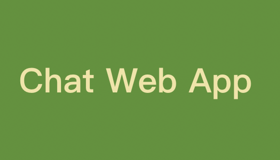

# Chat-Web-App

## About Chat Web App
**Core Functionality**: login and registration, sending chat messages, and viewing chat message history.

**Design highlights**: Real-time chat is achieved through low-latency bidirectional communication between the client and the server, implemented using flask_socketio.

## How To Deploy: 
[To be perfected]()
